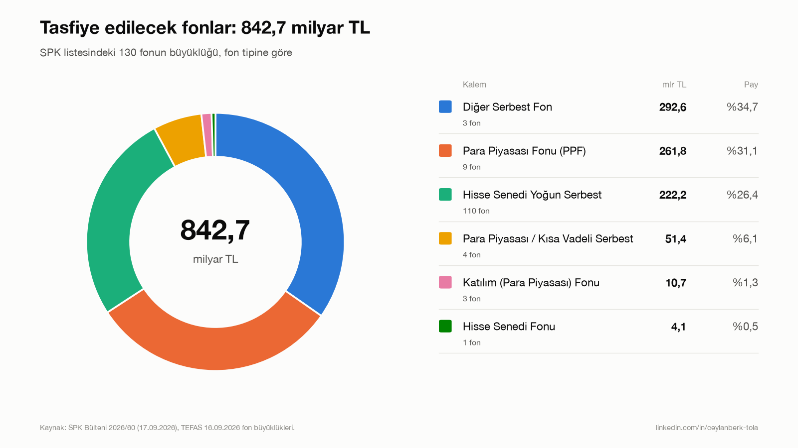
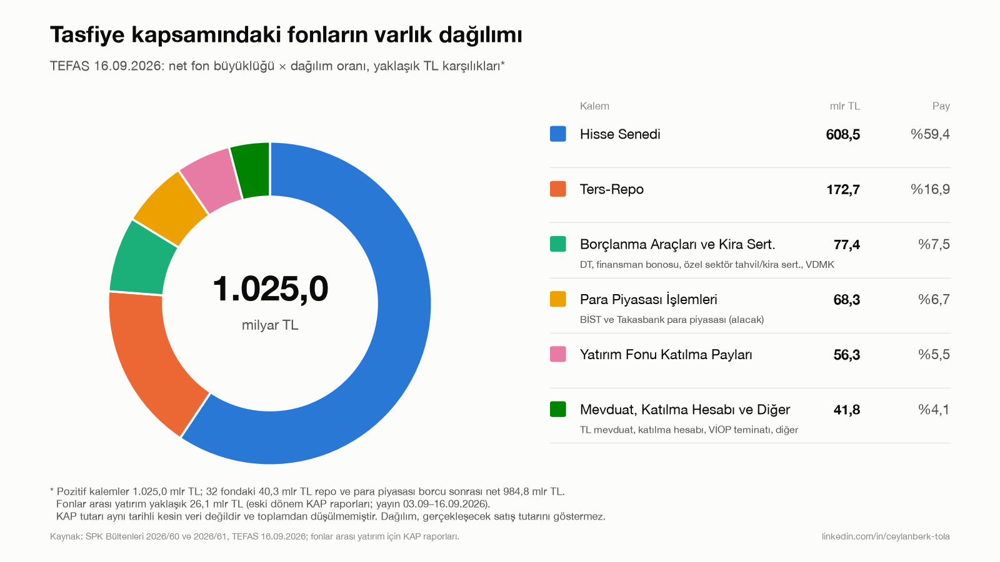
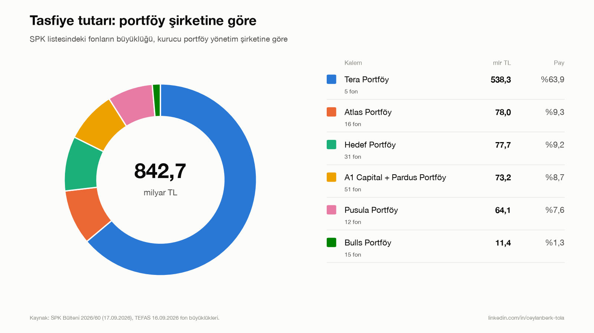

# SPK 2026/60: Tasfiye Edilecek Fonlar

SPK'nın 17.09.2026 tarihli 2026/60 sayılı bülteninde tasfiyesine karar verilen yatırım fonlarının analizi.
Karar Tera, Pusula, Hedef, Atlas, A1 Capital, Pardus ve Bulls portföy şirketlerinin 130 fonunu kapsıyor.
Fon büyüklükleri ve portföy dağılımları TEFAS'ın **16.09.2026** verisinden alındı.

## Sonuçlar

| | |
|---|---|
| Tasfiye edilecek fon | 130 |
| Toplam fon büyüklüğü (net varlık) | **842,7 milyar TL** |
| Brüt varlık | 883,0 milyar TL |
| Kaldıraç borcu (32 fon) | 40,3 milyar TL |
| Hisse senedi | 480,5 milyar TL |

## Çıktılar

<!-- CIKTILAR:BASLA -->
### 1. Fon tipine göre tasfiye tutarı



| Fon tipi | Fon | Büyüklük (mlr TL) | Pay | Yatırımcı* |
|:---|---:|---:|---:|---:|
| Diğer Serbest Fon | 3 | 292,6 | %34,7 | 150.318 |
| Para Piyasası Fonu (PPF) | 9 | 261,8 | %31,1 | 244.502 |
| Hisse Senedi Yoğun Serbest | 110 | 222,2 | %26,4 | 58.949 |
| Para Piyasası / Kısa Vadeli Serbest | 4 | 51,4 | %6,1 | 12.386 |
| Katılım (Para Piyasası) Fonu | 3 | 10,7 | %1,3 | 21.335 |
| Hisse Senedi Fonu | 1 | 4,1 | %0,5 | 31.609 |

TEFAS şemsiye fon türüne göre:

| Şemsiye fon türü | Fon | Büyüklük (mlr TL) | Pay | Yatırımcı* |
|:---|---:|---:|---:|---:|
| Serbest Şemsiye Fonu | 117 | 566,2 | %67,2 | 221.653 |
| Para Piyasası Şemsiye Fonu | 9 | 261,8 | %31,1 | 244.502 |
| Katılım Şemsiye Fonu | 3 | 10,7 | %1,3 | 21.335 |
| Hisse Senedi Şemsiye Fonu | 1 | 4,1 | %0,5 | 31.609 |

### 2. Varlık türüne göre tasfiye tutarı



Fon büyüklüğü × TEFAS portföy dağılım oranı. Negatif tutarlar kaldıraçlı fonların repo ve para piyasası borçlarıdır; net toplam fon büyüklüğüne eşittir.

| Varlık | Brüt (mlr TL) | Borç (mlr TL) | Net (mlr TL) | Net pay |
|:---|---:|---:|---:|---:|
| Hisse Senedi | 480,5 |  | 480,5 | %57,0 |
| Ters-Repo | 172,7 |  | 172,7 | %20,5 |
| Borsa İstanbul Para Piyasası | 67,3 | -11,7 | 55,6 | %6,6 |
| Yatırım Fonları Katılma Payları | 42,5 |  | 42,5 | %5,0 |
| Devlet Tahvili | 23,4 |  | 23,4 | %2,8 |
| Özel Sektör Kira Sertifikaları | 23,2 |  | 23,2 | %2,8 |
| Finansman Bonosu | 21,3 |  | 21,3 | %2,5 |
| Mevduat (TL) | 18,4 |  | 18,4 | %2,2 |
| Katılma Hesabı (TL) | 13,5 |  | 13,5 | %1,6 |
| Varlığa Dayalı Menkul Kıymetler | 6,2 |  | 6,2 | %0,7 |
| Vadeli İşlemler Nakit Teminatları | 5,0 |  | 5,0 | %0,6 |
| BİST Taahhütlü İşlem Pazarı Satım | 3,5 |  | 3,5 | %0,4 |
| Özel Sektör Tahvili | 2,2 |  | 2,2 | %0,3 |
| Kamu Kira Sertifikaları (TL) | 1,0 |  | 1,0 | %0,1 |
| Girişim Sermayesi Yatırım Fonu Katılma Payları | 0,5 |  | 0,5 | %0,1 |
| Borsa Yatırım Fonları Katılma Payları | 0,4 |  | 0,4 | %0,1 |
| Takasbank Para Piyasası | 1,0 | -0,6 | 0,4 | %0,1 |
| Diğer | 0,3 |  | 0,3 | %0,0 |
| Hazine Bonosu | 0,0 |  | 0,0 | %0,0 |
| Repo | 0,0 | -28,0 | -28,0 | −%3,3 |

### 3. Portföy şirketine göre tasfiye tutarı



| Portföy şirketi | Fon | Büyüklük (mlr TL) | Pay | Yatırımcı* |
|:---|---:|---:|---:|---:|
| Tera | 5 | 538,3 | %63,9 | 323.299 |
| Atlas | 16 | 78,0 | %9,3 | 59.915 |
| Hedef | 31 | 77,7 | %9,2 | 27.593 |
| A1 Capital + Pardus | 51 | 73,2 | %8,7 | 42.299 |
| Pusula | 12 | 64,1 | %7,6 | 60.357 |
| Bulls | 15 | 11,4 | %1,3 | 5.636 |

### En büyük 10 fon

| Kod | Fon | Büyüklük (mlr TL) | Yatırımcı |
|:---|:---|---:|---:|
| TLY | TERA PORTFÖY BİRİNCİ SERBEST FON | 243,6 | 102.616 |
| TP2 | TERA PORTFÖY PARA PİYASASI (TL) FONU | 224,4 | 167.000 |
| DOH | TERA PORTFÖY DÖRDÜNCÜ HİSSE SENEDİ SERBEST (TL) FON (HİSSE SENEDİ YOĞUN FON) | 45,3 | 41.799 |
| DFI | ATLAS PORTFÖY SERBEST FON | 31,3 | 47.521 |
| PKZ | PUSULA PORTFÖY KUZEY HİSSE SENEDİ SERBEST (TL) FON (HİSSE SENEDİ YOĞUN FON) | 27,8 | 16 |
| PSE | ATLAS PORTFÖY PARA PİYASASI SERBEST FON | 22,8 | 5.636 |
| T3B | TERA PORTFÖY ÜÇÜNCÜ HİSSE SENEDİ SERBEST (TL) FON (HİSSE SENEDİ YOĞUN) | 20,7 | 18 |
| PRY | PUSULA PORTFÖY PARA PİYASASI (TL) FONU | 18,9 | 39.320 |
| ABG | ATLAS PORTFÖY DÖRDÜNCÜ SERBEST (TL) FON | 17,7 | 181 |
| KSA | HEDEF PORTFÖY KISA VADELİ SERBEST FON | 16,4 | 4.180 |

\* Yatırımcı sayıları fon bazında toplanmıştır; birden fazla fonda payı olan yatırımcı birden çok sayılır.

### Veri dosyaları

| Dosya | İçerik |
|:---|:---|
| [`fon_listesi.csv`](data/processed/fon_listesi.csv) | SPK bülteninden çıkarılan 130 fon |
| [`tasfiye_fonlar_detay.csv`](data/processed/tasfiye_fonlar_detay.csv) | Fon bazında TEFAS kodu, şemsiye türü, fon tipi, büyüklük, yatırımcı, fiyat |
| [`tasfiye_fonlar_dagilim.csv`](data/processed/tasfiye_fonlar_dagilim.csv) | Fon bazında portföy dağılımı (% ve TL), kaldıraç bilgisi |
| [`ozet_fon_tipi.csv`](data/processed/ozet_fon_tipi.csv) | Fon tipine göre özet |
| [`ozet_semsiye_fon_turu.csv`](data/processed/ozet_semsiye_fon_turu.csv) | Şemsiye fon türüne göre özet |
| [`ozet_sirket_grubu.csv`](data/processed/ozet_sirket_grubu.csv) | Portföy şirketine göre özet |
| [`ozet_varlik_dagilimi.csv`](data/processed/ozet_varlik_dagilimi.csv) | Varlık türüne göre brüt, borç ve net TL |
<!-- CIKTILAR:BITIS -->

## Kurulum ve çalıştırma

```bash
python3 -m venv .venv
.venv/bin/pip install -r requirements.txt
.venv/bin/python -m tasfiye          # tüm akış
.venv/bin/python -m tasfiye.plots    # yalnızca grafikler
.venv/bin/python -m tasfiye.report   # README çıktı tabloları
```

PDF'ten fon listesini çıkarmak için `pdftotext` gerekir (`brew install poppler`).

## Akış

| Adım | Modül | Girdi | Çıktı |
|---|---|---|---|
| 1 | `tasfiye.extract` | `data/raw/spk_bulten_2026-60.pdf` | `fon_listesi.csv` |
| 2 | `tasfiye.dataset` | fon listesi + `tefas_genel_20260916.txt` | `tasfiye_fonlar_detay.csv`, `ozet_fon_tipi.csv`, `ozet_semsiye_fon_turu.csv`, `ozet_sirket_grubu.csv` |
| 3 | `tasfiye.allocation` | detay + `tefas_dagilim_20260916.txt` | `tasfiye_fonlar_dagilim.csv`, `ozet_varlik_dagilimi.csv` |
| 4 | `tasfiye.plots` | işlenmiş veriler | `output/grafikler/*.png` |
| 5 | `tasfiye.report` | özet CSV'ler | `README.md` çıktılar bölümü |

## Veri kaynakları ve notlar

- **TEFAS verisi ham snapshot olarak repoda duruyor.** TEFAS bot koruması arkasında olduğu için veri tarayıcı üzerinden
  `api/funds/fonGnlBlgSiraliGetir` (genel bilgiler) ve `api/funds/dagilimSiraliGetirT` (portföy dağılımı) uç noktalarından çekildi.
  Kod bu dosyaları okur, TEFAS'a bağlanmaz.
- **Fon eşleştirme:** SPK listesindeki unvanlar TEFAS unvanlarıyla eşleştirildi. `tefas_genel` dosyası SPK listesindeki sıra numarasıyla bağlanır.
- **Şemsiye fon türü**, fonun bağlı olduğu şemsiye fonun TEFAS kategorisidir. **Fon tipi** ise grafikler için şemsiye türü ve unvandan türetilen sınıflamadır.
- **Kaldıraç:** Portföy dağılımında repo ve para piyasası borçları negatif yüzde olarak gelir.
  Varlık grafiği brüt tutarı gösterir; borç düşülünce toplam, fon büyüklüğüne (842,7 mlr TL) eşitlenir.
- A1 Capital ve Pardus portföy şirketleri raporlamada tek grup olarak ele alındı.
- `gsykb` alanının TEFAS arayüzünde etiketi yok; "Girişim Sermayesi Yatırım Fonu Katılma Payları" olarak yorumlandı (0,5 mlr TL).
